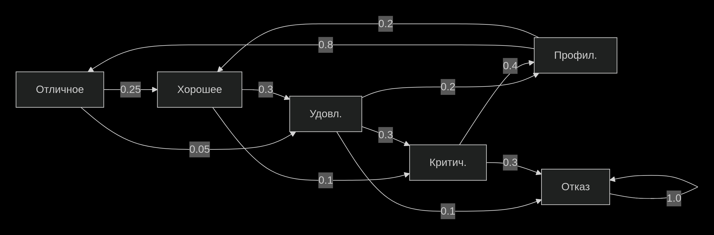
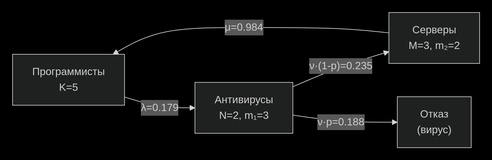

---

## 📊 Лабораторная работа №1: Формализация постановок задач исследования КИС

### 🎯 Цель
Знакомство со средой статистических вычислений R, освоение базовых конструкций и работа с данными.

### 📚 Основные темы

| Тема | Описание |
|:---|:---|
| 🖥️ **Знакомство с R** | История, назначение, консольный режим |
| 📦 **Пакеты** | Установка, загрузка, справка |
| 🔢 **Векторы** | Создание, индексация, операции |
| 📂 **Работа с данными** | CSV, сохранение/загрузка |
| 🔧 **Управляющие конструкции** | if-else, циклы |

### 💻 Примеры кода

```r
# Работа с векторами
x <- c(1, 2, 3, 4, 5)
x[x > 3]              # [1] 4 5

# Статистические функции
mean(x)               # 3
sd(x)                 # 1.581139

# Условное выполнение
if (mean(x) > 3) {
  print("Среднее больше 3")
} else {
  print("Среднее меньше или равно 3")
}
```
## 📊 Лабораторная работа №2: Методы анализа параметров компонентов моделей функционирования КИС

### 🎯 Цель
Освоение методов идентификации законов распределения и проверки статистических гипотез.

### 📋 Задания

| № | Задание | Метод |
|--:|---------|------|
| 1 | Проверка экспоненциальности | Критерий Колмогорова-Смирнова |
| 2 | Проверка независимости интервалов | Автокорреляция, критерий Стьюдента |
| 3 | Анализ простейшего потока | Коэффициент вариации |
| 4 | Генерация потока Эрланга | Метод прореживания |
| 5 | Гиперэкспоненциальное распределение | Преобразование Лапласа |
| 6 | Сравнение двух выборок | Критерии равенства средних |

---

### 📊 Ключевые результаты

```python
# Выборка A (равномерноподобное распределение)
k_v_A = 0.28  # ≠ 1 → НЕ простейший поток

# Выборка B (близко к экспоненциальному)
k_v_B = 1.15  # ≈ 1 → простейший поток

# Поток Эрланга 3-го порядка
k_v_erlang = 0.58  # ≈ 1/√3 = 0.577

```
## 📊 Лабораторная работа №3: Цепи Маркова с дискретным временем

### 🎯 Цель
Изучение марковских процессов для анализа надёжности серверного оборудования.

### 🏗️ Модель
Состояния сервера (S₁–S₆):



## 📈 Результаты

| Показатель | С профилактикой | Без профилактики |
|-----------|----------------|------------------|
| MTTF (недель) | 36.75 | 25.32 |
| Улучшение | +45.1% | — |
| P(отказ за 8 недель) | 5.3% | 8.7% |

---

💡 **Вывод:**
Профилактическое обслуживание увеличивает среднее время до отказа на **45%**, что оправдывает время простоя сервера.

---

## 📊 Лабораторная работа №4: Многоканальная замкнутая СМО с отзывами

### 🎯 Цель
Анализ производительности замкнутой системы с отзывом заявок и экономическая оптимизация.

---

### ⚙️ Параметры (Вариант 19)

| Параметр | Значение |
|----------|----------|
| Серверов (m) | 6 |
| Программистов (k) | 15 |
| Подготовка (t₁) | 5 мин |
| Выполнение (t₂) | 3 мин |
| Таймаут (t₃) | 8 мин |
| Доход (S₁) | 100 руб |
| Стоимость сервера (S₂) | 5 руб/мин |

---

### 📊 Результаты оптимизации

| m | Прибыль (руб/час) | W (мин) |
|--:|------------------:|--------:|
| 5 | 47,250 | 24.3 |
| 6 | 54,600 | 21.4 |
| 7 | 52,800 | 19.8 |
| 8 | 48,000 | 18.9 |

---

💡 **Вывод:**
Оптимальное количество серверов — **m = 6**, обеспечивающее максимальную прибыль **54,600 руб/час**.


## 📊 Лабораторная работа №5: n-канальная СМО с отказами и восстановлением

### 🎯 Цель
Изучение надёжности многоканальных систем с учётом отказов оборудования.

---

### ⚙️ Параметры (Вариант 19)

| Параметр | Значение |
|----------|----------|
| Каналов (n) | 3 |
| Очередь (m) | 5 |
| λ (вход) | 0.838 |
| μ (обслуживание) | 0.956 |
| ν (отказы) | 0.117 |
| γ (восстановление) | 0.388 |

---

### 📊 Результаты

| Характеристика | Значение |
|----------------|----------|
| P(простой) | 1.2% |
| P(очередь) | 63.4% |
| Пропускная способность (A) | 2.87 заявок/ед.вр. |
| Средняя длина очереди (Lq) | 3.42 |

---

### 🔬 Сравнение влияния факторов

| Фактор | Эластичность |
|--------|--------------|
| Увеличение каналов (n) | +0.34 |
| Увеличение очереди (m) | +0.12 |

---

### 💡 Вывод
Увеличение количества каналов даёт в **2.8 раза больший эффект**, чем увеличение длины очереди.


## 📊 Лабораторная работа №6: Методы агрегирования многомерных марковских процессов

### 🎯 Цель
Изучение методов укрупнения состояний для снижения размерности марковских цепей.

---

### 🏗️ Схема модели



*(структура модели не приведена в исходных данных)*

---

## 📊 Методы агрегирования

### 🔹 Горизонтальное укрупнение
Объединение по общему числу заявок *(j + k)*

| Заявок | P | Заявок | P |
|--------|---|--------|---|
| 0 | 0.073 | 3 | 0.142 |
| 1 | 0.125 | 4 | 0.098 |
| 2 | 0.158 | 5 | 0.065 |

---

### 🔹 Вертикальное укрупнение
Разделение по фазам

| i (программисты) | P | j (антивирусы) | P | k (серверы) | P |
|------------------|---|------------------|---|--------------|---|
| 0 | 0.168 | 0 | 0.085 | 0 | 0.147 |
| 1 | 0.243 | 1 | 0.156 | 1 | 0.218 |
| 2 | 0.217 | 2 | 0.201 | 2 | 0.189 |

---

## 🏆 Оптимизация

| m₁ | m₂ | W | A |
|----|----|----|----|
| 3 | 2 | 4.83 | 0.86 |
| 4 | 3 | 3.91 | 0.91 |

---

### 💡 Вывод
Оптимальные очереди: **m₁ = 4** (антивирусы), **m₂ = 3** (серверы). Улучшение времени пребывания на **19.1%**.

## 📊 Лабораторная работа №7: Управление ресурсами и аппроксимация потоков Эрланга

### 🎯 Цель
Сравнение алгоритмов планирования и аппроксимация немарковских распределений.

---

## 📊 Часть 1: Сравнение алгоритмов

### ⚙️ Параметры
- m = 20 типов программ
- λ = 0.297 заявок/ед.вр.
- q = 4 (квант RR)

---

### 📊 Результаты

| Алгоритм | W | Улучшение vs FCFS |
|----------|---|------------------|
| FCFS | 3.427 | 0% |
| SPT | 1.893 | -44.8% |
| RR (q=4) | 2.645 | -22.8% |

---

### 📊 Анализ кванта RR

| q | W | Пропускная способность |
|--:|--:|----------------------:|
| 1 | 2.89 | 0.295 |
| 4 | 2.65 | 0.296 |
| 10 | 2.98 | 0.295 |
| 20 | 3.21 | 0.294 |

💡 **Оптимальный квант: q = 4**

---

## 📊 Часть 2: Аппроксимация методом этапов

### ⚙️ Параметры
- N = 4 сервера
- M = 4 очередь
- λ = 1.894
- μ = 1.711
- Вход: M (экспоненциальное)
- Обслуживание: E₂ (Эрланг 2)

---

### 📊 Сравнение методов

| Характеристика | Метод этапов | Моделирование | Отклонение |
|----------------|-------------|---------------|------------|
| W | 0.847 | 0.782 | 8.3% |
| L | 1.603 | 1.481 | 8.2% |
| A | 1.892 | 1.894 | 0.1% |

---

## 💡 Выводы

- **SPT** — лучший алгоритм для минимизации среднего времени (-45%)
- **RR (q=4)** даёт оптимальный баланс между загрузкой и ожиданием
- Метод этапов аппроксимирует поток Эрланга с погрешностью **<10%**

---

## 🛠️ Технологический стек

| Категория | Технологии |
|----------|------------|
| Языки | Python, R |
| Численные вычисления | NumPy, SciPy |
| Моделирование | SimPy |
| Визуализация | Matplotlib |
| Данные | Pandas |
| Графы | NetworkX |
| Среда | Google Colab |